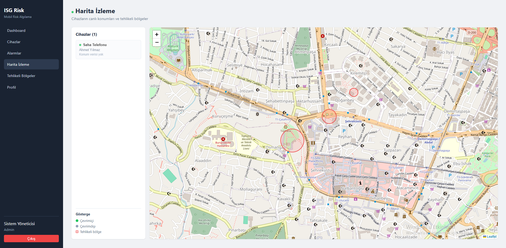
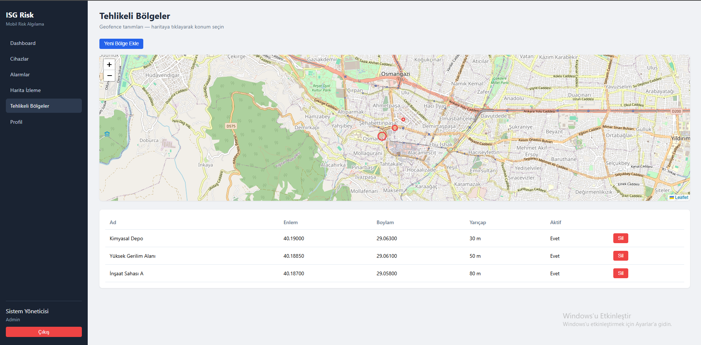
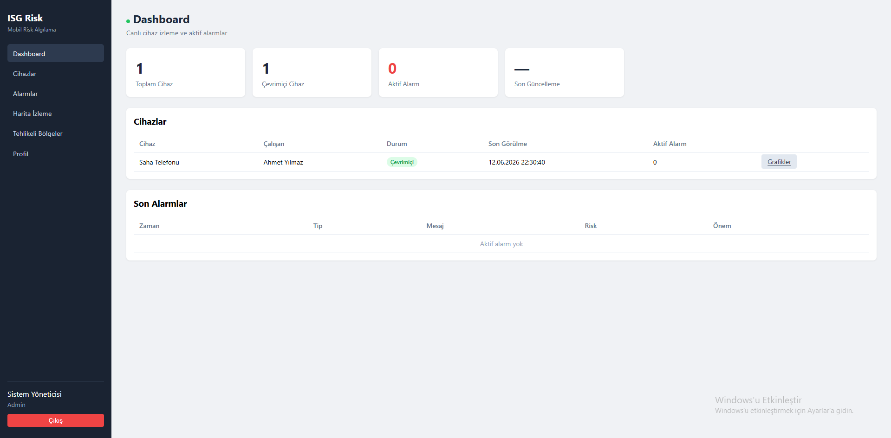
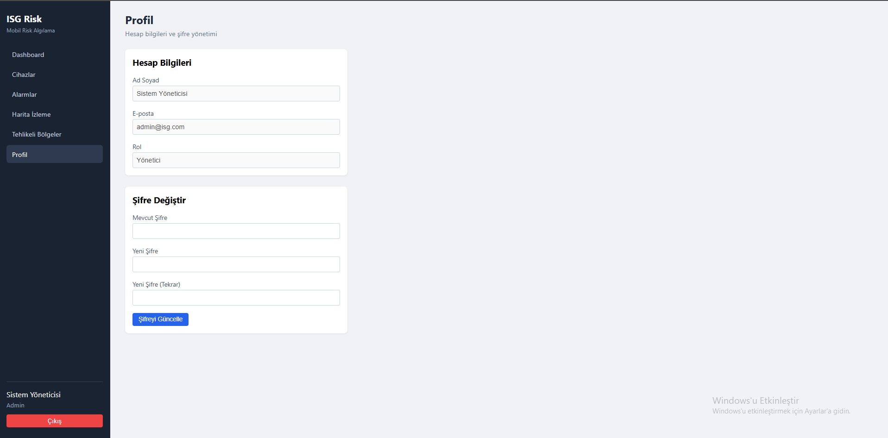
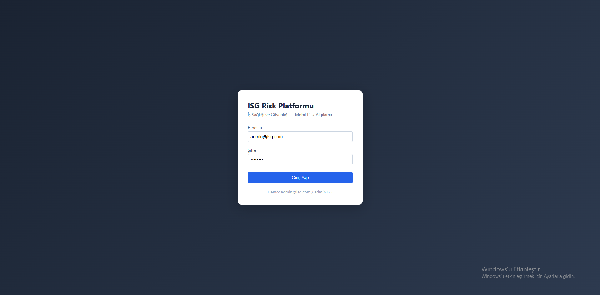
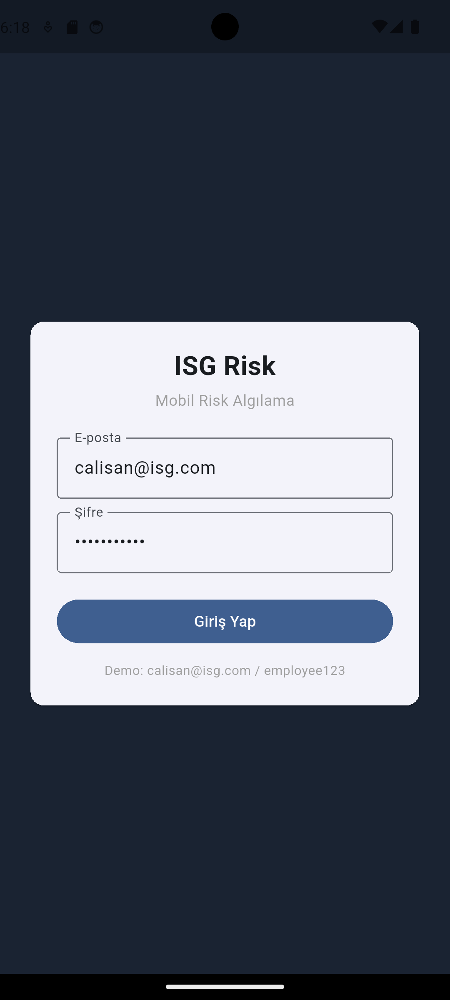
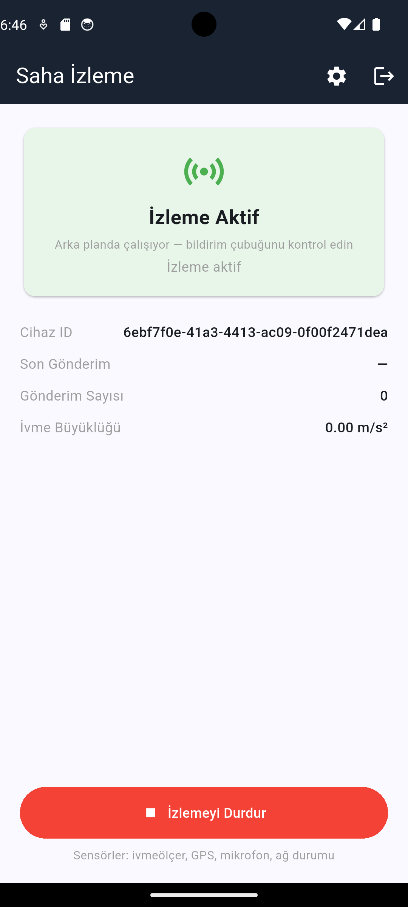

# İş Güvenliği İçin Mobil Risk Algılama Sistemi 

Bu proje, saha çalışanlarının güvenliğini en üst düzeye çıkarmak için geliştirilmiş entegre bir **IoT / Mobil Güvenlik Çözümüdür**. Cep telefonlarının ivmeölçer, GPS ve mikrofon gibi donanımlarını kullanarak işçilerin durumunu anlık olarak izler ve olası tehlikelerde (düşme, sert darbe, tehlikeli bölgeye giriş, yüksek gürültü) yönetim paneline anlık alarmlar iletir.



---

##  Öne Çıkan Özellikler

- **Gerçek Zamanlı Konum Takibi:** Çalışanlar harita üzerinden WebSockets (Socket.io) sayesinde anlık (gecikmesiz) olarak izlenir.
- **Düşme/Darbe Tespiti:** Z-Score ve eşik değer (threshold) algoritmalarıyla ivmeölçer verileri analiz edilir; olağandışı ivmelenmeler anında algılanır.
- **Tehlikeli Bölge (Geofencing) Kontrolü:** Çalışanlar yasaklı veya tehlikeli (radyasyon, yüksek gerilim vs.) bir alana girdiğinde sistem alarm verir.
- **İşçi Hareketsizlik Uyarısı:** Belirlenen süreden daha uzun süre hareketsiz kalan cihazlar tespit edilir.
- **Çok Platformlu Çözüm:** 
  - İzleme ve raporlama için modern **React / Web Paneli**.
  - Veri toplama için arka planda kesintisiz çalışan mobil uygulama.
- **Anlık Bildirimler:** Yüksek riskli durumlarda yöneticilere **Telegram** üzerinden acil durum mesajları otomatik gönderilir.

---

##  Ekran Görüntüleri

Projenin farklı modüllerine ait ekran görüntüleri aşağıda listelenmiştir.

###  Yönetici Web Paneli
Yöneticiler saha çalışanlarının anlık konumlarını, tehlikeli bölgeleri (kırmızı çemberler) ve sistemden gelen canlı uyarıları bu ekranda görürler.



Cihazlara dair detaylı analizlerin ve acil durum uyarılarının bulunduğu menüler:



Yöneticiyle ilgili arayüzler




###  Mobil Uygulama (Veri Toplama Modülü)
Saha çalışanının arka planda konum, ivme ve gürültü verilerini sürekli okuyup sunucuya aktardığı arayüz.

<p align="center">
  
  
</p>

---

##  Kullanılan Teknolojiler (Sistem Mimarisi)

1. **Backend / Sunucu:** Node.js, Express.js, Socket.io
2. **Veritabanı ve ORM:** PostgreSQL, Prisma ORM
3. **Web Arayüzü (Yönetici Paneli):** React, Vite, TailwindCSS, React-Leaflet, Recharts
4. **Mobil Veri Toplayıcılar:** .NET (MAUI) & Flutter (Dart)
5. **Dış Servis Entegrasyonları:** Telegram Bot API (Acil Bildirimler)

---

##  Kurulum ve Çalıştırma

### 1. Backend (Sunucu)
```bash
cd backend
npm install
# .env dosyanızı ayarlayın (DATABASE_URL, JWT_SECRET, TELEGRAM_BOT_TOKEN vb.)
npx prisma db push
npm run dev
```

### 2. Web Paneli (Yönetici Ekranı)
```bash
cd web
npm install
npm run dev
```

### 3. Mobil Uygulama (.NET)
```bash
cd HealthSafety
dotnet build
dotnet run
```
