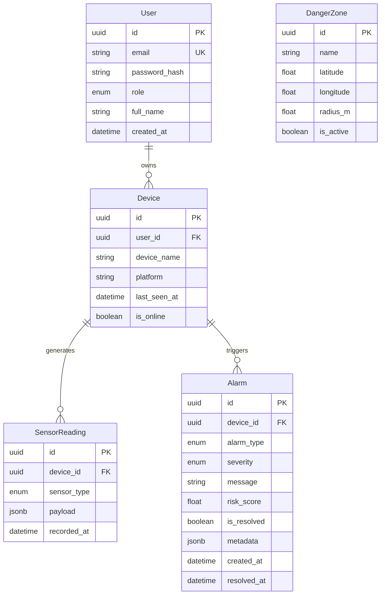

# Veri Modeli

## ER Diyagramı

## Enum Değerleri

### UserRole
- `admin` — Tam yetki
- `employee` — Kendi cihaz ve alarmları

### SensorType
- `accelerometer` — x, y, z ivme değerleri
- `gps` — lat, lng, accuracy
- `microphone` — decibels
- `network` — connected, type

### AlarmType
- `hard_impact` — Sert darbe
- `fall_suspected` — Düşme şüphesi
- `danger_zone_entry` — Tehlikeli bölge girişi
- `inactivity` — Uzun süre hareketsizlik
- `high_noise` — Yüksek gürültü
- `network_lost` — Ağ bağlantısı kopması
- `high_risk_score` — Yüksek risk puanı

### AlarmSeverity
- `low`, `medium`, `high`, `critical`

## İndeksler

- `sensor_readings(device_id, sensor_type, recorded_at)` — Zaman serisi sorguları
- `alarms(device_id, is_resolved, created_at)` — Alarm listeleme
